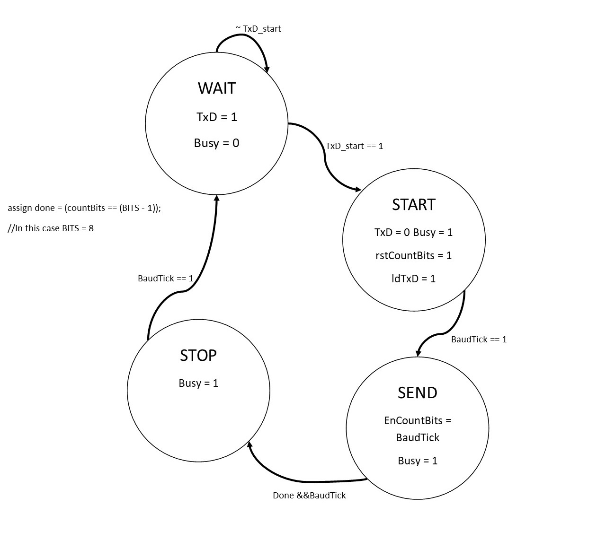
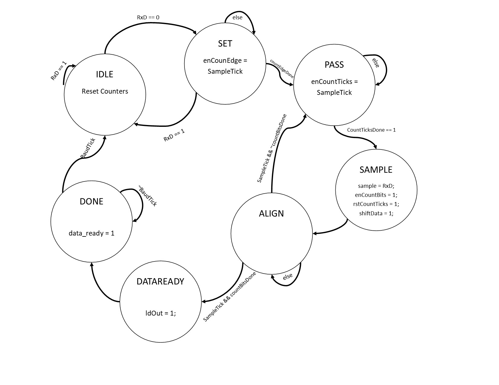

# Full-duplex-configurable-UART
Full duplex configurable UART for transmitting noisy voice from PC to FPGA and filtering voice using FIR filter on Altera DE2 board.

### How to test

Compile the project with Quartus II, and program it on DE2 Board, send the input.wav, which is a noisy sound, with Matlab.m to the FPGA.
Then, you can play the recieved audio file which is filtered. Note that you must connect DE2 board RS232 Connector to your computer. 

### Description

UART implementation, with 1 stop bit and without parity bit. The baud rate is 115200 Hz, but you can change it by changing the baudrate parameter in TopController.v.

The state machine of UART transmitter : 

The state machine of UART reciever : 

